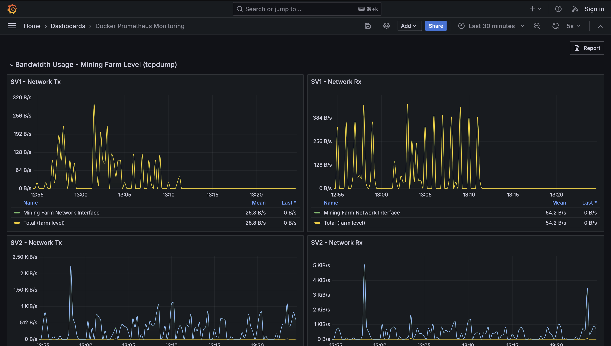

<h1 align="center">
  <br>
  <a href="https://stratumprotocol.org"></a>
  <br>
Stratum V2 - Benchmarking Tool 📏
  <br>
</h1>


## Overview

Stratum V2 is an essential upgrade to the current pooled mining protocol, Stratum. The existing protocol centralizes transaction selection in mining pools, making them potential attack vectors. Stratum V2 decentralizes this by allowing individual miners to create block templates, enhancing security and performance through an encrypted, binary protocol.

To promote the adoption of Stratum V2, a comprehensive benchmarking tool is needed. This tool tests and compares the performance of Stratum V1 and V2 in various mining scenarios, helping the mining industry understand and benefit from the new protocol.

## 🎯 Goals

1. **Enable miners and pool operators to easily test and benchmark SRI configurations**
2. **Facilitate testing, bug reporting, and feedback collection**
    - Provide a testing suite for each SRI configuration
    - Allow easy customization of role configurations
    - Integrate bug reporting mechanisms into the testing tool
3. **Provide a pre-built benchmarking tool for evaluating SV2 protocol performance**
    - Generate benchmark data for each SRI configuration
    - Automatically generate reports containing benchmark data
    - Compare protocol performance between SV2 and SV1
    - Allow external verification of benchmark data documented in the future SV1-SV2 comparison report

## ✨ Features

- **Comprehensive Testing Suite**: Evaluate different SRI configurations with customizable role settings.
- **Automated Benchmarking**: Generate and collect performance data automatically for both Stratum V1 and Stratum V2.
- **Detailed Reporting**: Create detailed reports comparing protocol performance, with easy-to-understand metrics and visualizations.
- **Integrated Bug Reporting**: Facilitate bug reporting and feedback collection directly within the tool.

📚 To dig more into tool's features. or understand how it is built, please have a look at *docs/* and read the [requirements document](./docs/requirements-document.md) or visualize the [system design](./docs/system-design.png) diagram.


## 🐳 Prerequisites

1. Install Docker on your system: https://docs.docker.com/engine/install/
  

## ⛏️ Getting Started

### Automatic Setup 🚀 

For the easiest setup, use the provided script to automatically configure and start the benchmarking tool:

1. **Download or clone the repository** if you haven't already:
    ```bash
    git clone https://github.com/stratum-mining/benchmarking-tool.git
    cd benchmarking-tool
    ```

2. **Run the benchmarking tool setup script**:
    ```bash
    ./run-benchmarking-tool.sh
    ```

    The script will guide you through the process, allowing you to select configurations, networks, and other parameters interactively.

### Manual Setup 🛠

If you prefer to set up the benchmarking tool manually, follow these detailed steps:

1. **Clone the repository**:
    ```bash
    git clone https://github.com/stratum-mining/benchmarking-tool.git
    cd benchmarking-tool
    ```

2. **Configure the benchmarking parameters**:
    To configure the benchmarking tool, you'll need to update several parameters based on your specific requirements:
   - *Network*: choose between `mainnet`, `testnet3`, or `testnet4`
     - Edit the `NETWORK` parameter in [.env](.env) and enter the network you want to use for the benchmarks
  
      🚨 If you are going to use `mainnet`, you need to leave an empty string there --> `NETWORK=`
    
   - *SV2 block templates refresh interval*: specify frequency in which you will get refreshed block templates for SV2
     - Edit the `SV2_INTERVAL` parameter in [.env](.env) and enter the number of seconds you desire
    
      🚨 The `SV1 Pool` used in the benchmarking tool will generate a new block template every 60 seconds. Note that this value will affect the bandwidth used and tracked (especially in `configuration C`)
    
   - *Hashrate*: specify the hashrate you're going to point to the tool for SV2
     - Edit the `min_individual_miner_hashrate` and `channel_nominal_hashrate` parameters placed in:
       - [custom-configs/config-a/sri-roles/tproxy-config-a-docker-example.toml](custom-configs/sri-roles/config-a/tproxy-config-a-docker-example.toml)
       - [custom-configs/config-c/sri-roles/tproxy-config-c-docker-example.toml](custom-configs/sri-roles/config-c/tproxy-config-c-docker-example.toml)
    
      👉 E.g. for a 100 Th/s machine, you will need to set `100_000_000_000_000.0`
    
   - *Coinbase tx output*: enter your custom `public key` (or `redeem script`) with the `script_type` to be used as output in the coinbase transaction
     - Edit the `coinbase_output` parameter placed in:
       - [custom-configs/sri-roles/config-a/jds-config-a-docker-example.toml](custom-configs/sri-roles/config-a/jds-config-a-docker-example.toml)
       - [custom-configs/sri-roles/config-a/jdc-config-a-docker-example.toml](custom-configs/sri-roles/config-a/jdc-config-a-docker-example.toml)
       - [custom-configs/sri-roles/config-c/pool-config-c-docker-example.toml](custom-configs/sri-roles/config-c/pool-config-c-docker-example.toml)
    
      💡 If you still don't have a public key, setup a new wallet and extract the extended public key it provides. At this point, you can derive the child public key using this script: https://github.com/stratum-mining/stratum/tree/dev/utils/bip32-key-derivation 
    
   - *Pool signature*: enter a custom string to be inserted into the coinbase transaction (if you don't like the default one `"Stratum V2 SRI Pool"`)
     - Edit the `pool_signature` parameter placed in:
       - [custom-configs/sri-roles/config-a/pool-config-a-docker-example.toml](custom-configs/sri-roles/config-a/pool-config-a-docker-example.toml)
       - [custom-configs/sri-roles/config-a/jdc-config-a-docker-example.toml](custom-configs/sri-roles/config-a/jdc-config-a-docker-example.toml)
       - [custom-configs/sri-roles/config-c/pool-config-c-docker-example.toml](custom-configs/sri-roles/config-c/pool-config-c-docker-example.toml)

3. **Start the benchmarking tool**:
   After updating the configuration files, start the benchmarking tool using Docker Compose with the appropriate configuration file.

   To run `configuration A`:
   ```bash
   docker compose -f docker-compose-config-a.yaml up -d
   ```
   To run `configuration C`:
   ```bash
   docker compose -f docker-compose-config-c.yaml up -d
   ```

4. **Point miners to the following endpoints**
    - For Stratum V1:
      ```bash
      stratum+tcp://<host-ip-address>:3333
      ```
      🚨 For SV1, you should use the address format `[bitcoin_address].[nickname]` as the username in your miner setup.
      E.g. to correctly run a CPU miner, you need to run it with: `./minerd -a sha256d -o stratum+tcp://127.0.0.1:3333 -q -D -P -u tb1qa0sm0hxzj0x25rh8gw5xlzwlsfvvyz8u96w3p8.sv2-gitgab19`
  
    - For Stratum V2:
      ```bash
      stratum+tcp://<host-ip-address>:34255
      ```
  
   💡If you don't have a physical miner, you can do tests with CPUMiner.
  Setup the correct CPUMiner for your OS:
    - You can download the binary directly from [here](https://sourceforge.net/projects/cpuminer/files/);
    - Or compile it from [https://github.com/pooler/cpuminer](https://github.com/pooler/cpuminer)

    On the CPUMiner directory:
  
    ```bash
    ./minerd -a sha256d -o stratum+tcp://<host-ip-address>:34255 -q -D -P
    ```

5. **Access the Grafana dashboard** 📊
   
    Open your browser and navigate to http://localhost:3000/d/64nrElFmk/sri-benchmarking-tool 
   

   
<br>

6. **Explore and export data** 📄

    Navigate between your charts, and click the `Report` button placed in the top right corner to download a PDF containing plots and data for the desired timeframe selected 

    👉 it will take some minutes to generate a complete PDF, so please be patient :) 


7. **Analyze report** 📄
  
    To effectively analyze the report produced by this tool, it is recommended to review the following document that explains the tool's architecture, the methodology for metrics collection, and provides guidelines for analyzing the report: https://github.com/stratum-mining/benchmarking-tool/tree/main/docs/benchmarking-tool-overview.pdf

    This comprehensive document will help you understand the data and draw meaningful conclusions from your benchmarking results.


8.  **Download Logs from the Grafana Dashboard**

    We’ve added a feature that allows you to download logs of all containers directly from the Grafana dashboard. Here’s how to use it:

      - Navigate to the Grafana dashboard.
      - Look for the 'Download Logs' button and click on it.
      - The logs will be downloaded as a .tar file.

    To check logs of the containers and if facing any issues and want help, kindly share the logs in the [benchmarking channel on Discord](https://discord.com/channels/950687892169195530/1107964065936060467).


## 🛣 Roadmap 

The roadmap of this project can be found [here](https://docs.google.com/document/d/1CqcvsxGugFjWy4e4Yf6PjxCs2O4puwlFBO6M0TRL4qE/edit#heading=h.h9x57vygfk4q).

A GitHub project board is also used for defining specific milestones and prioritizing tasks: https://github.com/orgs/stratum-mining/projects/10 

## 📖 License

This software is licensed under Apache 2.0 or MIT, at your option.
