# Benchmarking Tool Overview: Metrics, Data Collection, and Analysis 

## Introduction

This document describes the objective, design, and functionality of a benchmarking tool for evaluating performance of the original Stratum mining protocol as compared to Stratum V2 protocol. This tool helps facilitate the adoption of Stratum V2 by providing comprehensive performance metrics and insights across various mining scenarios. By enabling industry professionals and the mining community to assess the improvements in security, and efficiency brought by SV2, this tool is crucial in promoting transition to the upgraded protocol, ultimately strengthening the Bitcoin network.

## Overview of the Benchmarking Tool 👁️

The Benchmarking Tool is composed of several core components and metrics collectors. Each component is a Docker container which enables streamlined networking and precise metric measurement. The tool covers [Configuration A and C](https://stratumprotocol.org) for Stratum V2. These two configurations are coupled with a Stratum solo mining pool for comparison. Below is an overview of each component and its role in benchmarking.

#### _Core Components_

The following components form the backbone of the system

* **SRI (SV2) Roles:** Docker images for [every role](https://github.com/stratum-mining/stratum/tree/dev/roles) available in the Stratum V2 Reference Implementation (SRI) stack:
    * [SV2 Pool](https://github.com/stratum-mining/stratum/tree/dev/roles/pool)
    * [SV2 Job Declarator Server](https://github.com/stratum-mining/stratum/tree/dev/roles/jd-server)
    * [SV2 Job Declarator Client](https://github.com/stratum-mining/stratum/tree/dev/roles/jd-client)
    * [Translator Proxy](https://github.com/stratum-mining/stratum/tree/dev/roles/translator)
    * [Template Provider - Pool Side](https://github.com/Sjors/bitcoin/releases)
    * [Template Provider - Miner Side](https://github.com/Sjors/bitcoin/releases)
* **SV1 Pool:** This is the service that will be used to benchmark SV1 scenarios:
    * Public Pool by @benjamin-wilson: [ GitHub Repository](https://github.com/benjamin-wilson/public-pool)

#### _Metrics Collectors and Observers_

These components are responsible for collecting all defined metrics, providing insights into system performance

* **Custom Proxies:** Collect specific time measurements and latency metrics in particular scenarios, developed using the library by @fi3:[ Demand Easy SV2](https://github.com/demand-open-source/demand-easy-sv2)
* **Cadvisor:** Captures fundamental metrics at a container level, such as CPU, memory, and networking usage. Metrics are exposed for collection by Prometheus. [More info](https://github.com/google/cadvisor) 
* **Prometheus + Node Exporter:** Prometheus is a reliable and scalable monitoring and alerting toolkit that organizes metrics into a time-series database. Node Exporter exposes hardware and kernel-related metrics.[ Prometheus](https://github.com/prometheus/prometheus) |[ Node Exporter](https://github.com/prometheus/node_exporter)
* **Grafana:** A visualization tool that integrates with Prometheus to create interactive and customizable dashboards.
* **Other Tools:** These include additional utilities to compute specific metrics and fulfill remaining requirements:
    * **network-traffic-metrics by @zaneclaes:** A tool based on tcpdump for retrieving specific socket usage. [More info](https://github.com/zaneclaes/network-traffic-metrics)
    * **reporter by @IzakMarais:** Used for generating PDF reports from Grafana data and dashboards.[ More Info](https://github.com/IzakMarais/reporter)

## Integration and Automation 🐳

**Tool Workflow:** The benchmarking tool's architecture ensures seamless integration and smooth data collection across various components. The workflow is organized as follows:

1. **Initialization:** All Docker containers, including those for SV1 and SV2 roles, metrics collectors, and supporting tools, are initiated.
2. **Data Collection:** Custom proxies, cadvisor, Prometheus, and other data collectors start monitoring and gathering metrics as defined in the configurations. These tools capture detailed performance data related to shares, blocks, latency, propagation times, bandwidth usage, and resource consumption.
3. **Metrics Aggregation:** Prometheus collects and organizes metrics from various collectors into a time-series database. Node Exporter provides additional hardware and kernel-level data to Prometheus.
4. **Visualization:** Grafana interfaces with Prometheus to present the collected data in interactive and customizable dashboards, allowing users to analyze performance metrics in real-time.
5. **Report Generation:** The reporter tool fetches data from Grafana dashboards and generates comprehensive PDF reports summarizing the performance insights.

**Automation:** To streamline the benchmarking process, automation is employed at various stages:

1. **Container Management:** Docker Compose scripts are used to manage the lifecycle of all Docker containers, ensuring they are correctly started, stopped, and restarted as necessary.
2. **Data Collection Automation:** Custom scripts and Prometheus configuration files automate the data collection process. These scripts ensure continuous and accurate monitoring by scheduling regular data pulls and pushing metrics into the Prometheus database.
3. **Latency Measurement:** A script automatically computes average latency with major public pools by periodically subscribing to these pools and recording round trip times (RTT).
4. **Data Analysis Automation:** Prometheus rules and alerting configurations automatically analyze collected metrics, identifying trends, anomalies, and key performance indicators.
5. **Report Automation:** The reporter tool is configured to automatically generate PDF reports at predefined intervals or upon completion of specific benchmarking scenarios, ensuring timely delivery of insights.
6. **Network Emulation:** Traffic control (tc) configurations enforce network latency between containerized components, simulating real-world conditions for accurate benchmarking.

By leveraging these automation techniques, the benchmarking tool minimizes manual intervention, ensuring a reliable and efficient benchmarking process that provides consistent and accurate performance insights for both Stratum V1 and Stratum V2 protocols.

## Metrics analyzed 📐

Following the grafana dashboard structure, the following lists measurements with related explanation. All metrics currently captured by the benchmarking tool are visible on the dashboard.

* **Shares, blocks and templates stats**
    * SV1 shares
        * _Description_: Shares submitted by the miner(s) used to benchmark SV1
        * _Data Collection Method_: SV1 custom proxy located between the miner and the SV1 Pool forwards all traffic and extracts shares
        * _Data_: shares are analyzed and tracked as
            * number of submitted shares
            * number of valid shares
            * number of stale shares
            * acceptance rate percentage
    * SV1 mined blocks
        * _Description_: Blocks mined by the miner(s) used to benchmark SV1
        * _Data Collection Method_: SV1 custom proxy located between the Bitcoin node and the SV1 Pool forwards all traffic and extracts blocks submissions to the network
        * _Data_: count of blocks mined
    * SV2 shares
        * _Description_: Shares submitted by the miner(s) used to benchmark SV2
        * _Data Collection Method_: SV2 custom proxy located between the miner and the SV2 Pool or SV2 Job Declarator Client (JDC) forwards all the traffic and extracts shares
        * _Data_: shares are analyzed and tracked as
            * number of submitted shares
            * number of valid shares
            * number of stale shares
            * acceptance rate percentage  
    * SV2 mined blocks
        * _Description_: Blocks mined by the miner(s) used to benchmark SV2
        * _Data Collection Method_: SV2 custom proxy located between the miner and SV2 Pool or SV2 Job Declarator Client (JDC) forwards all the traffic and extracts block submissions
        * _Data_: count of blocks mined
    * SV1 - block templates value
        * _Description_: Block templates value extracted while mining on SV1 block templates
        * _Data Collection Method_: SV1 custom proxy located between the Bitcoin node and SV1 Pool forwards all the traffic and extracts the block templates value
        * _Data_: total value (subsidy + fees) of a block template in sats
    * SV2 - block templates value
        * _Description_: Block templates value extracted while mining on SV2 block templates
        * _Data Collection Method_: SV2 custom proxy located between the Bitcoin node (TP) and SV2 Pool or SV2 Job Declarator Client (JDC) forwards all the traffic and extracts the block templates value
        * _Data_: total value (subsidy + fees) of a block template in sats
* **Latency and time measurements**
    * Average latency with major pools (RTT)
        * _Description_: Average latency with major public pools
        * _Data Collection Method_: Every minute a script automatically computes the average latency (round trip time, RTT) for a list of public pools
        * _Data_: 
            - computed average latency - used to enforce the latency between containerized Pool roles (Pool, Job Declarator Server) and Miner roles (Job Declarator Client, Translator) by using [tc](https://man7.org/linux/man-pages/man8/tc.8.html)
    * SV1 - time to get a new job from Pool
        * _Description_: Time to receive a new job from the SV1 Pool
        * _Data Collection Method_: SV1 custom proxy located between the miner and the SV1 Pool extracts new job notifications,  tracking the timestamp. Another custom proxy between the Bitcoin node and the SV1 Pool extracts the new templates sent to the SV1 Pool, tracking the timestamp. The delta of these two times is used to calculate the time to get a new job from Pool
        * _Data_: time to get new job in milliseconds
    * SV2 - time to get a new job from Pool or JDC
        * _Description_: Time to receive a new job from the SV2 Pool or SV2 Job Declarator Client (JDC)
        * _Data Collection Method_: SV2 custom proxy located between the miner and the SV2 Pool or SV2 Job Declarator Client (JDC) extracts the new job notifications,  tracking the timestamp. Another custom proxy between the Bitcoin node (TP) and the SV2 Pool or SV2 Job Declarator Client (JDC) extracts the NewTemplate message sent to the SV2 Pool or SV2 Job Declarator Client (JDC). The delta of this time is used for measurement.
        * _Data_: time to get new job in milliseconds
    * SV1 - time to get a new job (after a new block found) from Pool
        * _Description_: Time it takes to receive a new job from the SV1 Pool with a new block
        * _Data Collection Method_: SV1 custom proxy located between the miner and the SV1 Pool extracts new job notifications,  tracking the timestamp. Another custom proxy between the Bitcoin node and the SV1 Pool extracts the new templates (based on a new prev-hash) sent to the SV1 Pool. The delta is recorded and displayed
        * _Data_: time to get new job in milliseconds
    * SV2 - time to get a new job (after a new block found) from Pool or JDC
        * _Description_: time it takes to receive a new job based on a new prev-hash (so after a new block is found in the network) from the SV2 Pool or SV2 Job Declarator Client (JDC)
        * _Data Collection Method_: SV2 custom proxy located between the miner and the SV2 Pool or SV2 Job Declarator Client (JDC) extracts the new job notifications,  tracking the timestamp. Another custom proxy between the Bitcoin node (TP) and the SV2 Pool or SV2 Job Declarator Client (JDC) extracts the SetNewPrevHash message sent to the SV2 Pool or SV2 Job Declarator Client (JDC). The delta of these times is recorded and displayed.
        * _Data_: time to get new job in milliseconds
    * SV1 block propagation time
        * _Description_: Time to propagate a valid block found by the SV1 miner to the Bitcoin network
        * _Data Collection Method_: SV1 custom proxy located between the Bitcoin node and the SV1 Pool extracts a block’s submission. Another custom proxy between the miner and the SV1 Pool extracts the shares submission, tracking their timestamp. The delta of these times is recorded and displayed.
        * _Data_: time between share submission of found block and when the bitcoin node receives the block in milliseconds
    * SV2 block propagation time
        * _Description_: Time to propagate a valid block found by the SV2 miner to the Bitcoin network
        * _Data Collection Method_: SV2 custom proxy located between the Bitcoin node (TP) and the SV2 Pool or SV2 Job Declarator Client (JDC) extracts a block's submission. Another custom proxy between the miner and the SV2 Pool or SV2 Job Declarator Client (JDC) extracts the shares submission, tracking the timestamp. The delta of these times is recorded and displayed.
        * _Data_: time between share submission of found block and when the bitcoin node receives the block in milliseconds
* **Bandwidth Usage - Mining Farm Level**
    * SV1 - Network Tx
        * _Description_: Amount of data transmitted from the SV1 mining farm (machines) to the SV1 Pool.
        * _Data Collection Method_: [network-traffic-metrics](https://github.com/zaneclaes/network-traffic-metrics) tool (which is based on _tcpdump_) constantly tracks the number of bytes transmitted between every role included in the testing environment
        * _Data_: outbound traffic filtered by IP
    * SV1 - Network Rx
        * _Description_: Amount of data transmitted from the SV1  Pool to the SV1 mining farm (machines)
        * _Data Collection Method_: [network-traffic-metrics](https://github.com/zaneclaes/network-traffic-metrics) tool (which is based on _tcpdump_) constantly tracks the number of bytes transmitted between every role included in the testing environment
        * _Data_: inbound traffic filtered by IP
    * SV2 - Network Tx
        * _Description_: Amount of data transmitted from the SV2 mining farm roles (SV2 Translator, SV2 JDC, and TP) to the SV2 Pool, SV2 JDS, and other Bitcoin peers.
        * _Data Collection Method_: [network-traffic-metrics](https://github.com/zaneclaes/network-traffic-metrics) tool (which is based on _tcpdump_) constantly tracks the number of bytes transmitted between every role included in the testing environment
        * _Data_: outbound traffic filtered by IP
    * SV2 - Network Rx
        * _Description_: Amount of data transmitted from the SV2 mining farm roles (SV2 Translator, SV2 JDC, and TP) to the SV2 Pool, SV2 JDS, and other Bitcoin peers.
        * _Data Collection Method_: [network-traffic-metrics](https://github.com/zaneclaes/network-traffic-metrics) tool (which is based on _tcpdump_) is used to constantly track the number of bytes transmitted between every role included in the testing environment
        * _Data_: inbound traffic filtered by IP
* **Bandwidth Usage - Pool Level**
    * SV1 - Network Tx
        * same as for the aforementioned, but from the Pool’s perspective
    * SV1 - Network Rx
        * same as for the aforementioned, but from the Pool’s perspective
    * SV2 - Network Tx
        * same as for the aforementioned, but from the Pool’s perspective
    * SV2 - Network Rx
        * same as for the aforementioned, but from the Pool’s perspective
* **SV1 roles performances**
    * Pool roles - CPU usage
        * _Description_: CPU usage (percentage) of SV1 roles running as Pool’s infrastructure (SV1 Pool and SV1 Bitcoin node)
        * _Data Collection Method_: [cadvisor](https://github.com/google/cadvisor) is used to constantly track the CPU usage of every Docker container 
    * Pool roles - memory usage
        * _Description_: Memory usage of SV1 roles running as Pool’s infrastructure (SV1 Pool and SV1 Bitcoin node)
        * _Data Collection Method_: [cadvisor](https://github.com/google/cadvisor) is used to constantly track the memory usage of every Docker container 
    * Pool roles - Network Tx
        * _Description_: Amount of data transmitted from the SV1 roles running as Pool’s infrastructure (SV1 Pool and SV1 Bitcoin node)
        * _Data Collection Method_: [cadvisor](https://github.com/google/cadvisor) is used to constantly track the bandwidth usage of every Docker container 
        * _Data_: since cadvisor tracks metrics on a container level, the total amount of bandwidth measured even includes the one consumed between SV1 Pool and Bitcoin node, which are typically ran in the same network, so it’s not meaningful. Infrastructure run on separate networks should observe this metric more closely.
    * Pool roles - Network Rx 
        * _Description_: amount of data received by the SV1 roles running as Pool’s infrastructure (SV1 Pool and SV1 Bitcoin node)
        * _Data Collection Method_: [cadvisor](https://github.com/google/cadvisor) is used to constantly track the bandwidth usage of every Docker container 
        * _Data_: since cadvisor tracks metrics on a container level, the total amount of bandwidth measured even includes the one consumed between SV1 Pool and Bitcoin node, which are typically ran in the same network, so it’s not meaningful. Infrastructure run on separate networks should observe this metric more closely.
* **SV2 roles performances**
    * Pool roles - CPU usage
        * _Description_: CPU usage (percentage) due to SV2 roles running as Pool’s infrastructure (SV2 Pool, SV2 Bitcoin node (TP), SV2 Job Declarator Server)
        * _Data Collection Method_: [cadvisor](https://github.com/google/cadvisor) is used to constantly track the CPU usage of every Docker container
    * Pool roles - memory usage
        * _Description_: Memory usage due to SV2 roles running as Pool’s infrastructure (SV2 Pool, SV2 Bitcoin node (TP), SV2 Job Declarator Server)
        * _Data Collection Method_: [cadvisor](https://github.com/google/cadvisor) is used to constantly track the CPU usage of every Docker container
    * Pool roles - Network Tx
        * _Description_: Amount of data transmitted from the SV2 roles running as Pool’s infrastructure (SV2 Pool, SV2 Bitcoin node (TP), SV2 Job Declarator Server)
        * _Data Collection Method_: [cadvisor](https://github.com/google/cadvisor) is used to constantly track the bandwidth usage of every Docker container 
        * _Data_: since cadvisor tracks metrics on a container level, the total amount of bandwidth measured even includes the one consumed between SV2 Pool and Bitcoin node (TP), which are typically ran in the same network, so it’s not meaningful. Infrastructure run on separate networks should observe this metric more closely.
    * Pool roles - Network Rx 
        * _Description_: Amount of data received by the SV2 roles running as Pool’s infrastructure (SV2 Pool, SV2 Bitcoin node (TP), SV2 Job Declarator Server)
        * _Data Collection Method_: [cadvisor](https://github.com/google/cadvisor) is used to constantly track the bandwidth usage of every Docker container 
        * _Data_: since cadvisor tracks metrics on a container level, the total amount of bandwidth measured even includes the one consumed between SV2 Pool and Bitcoin node (TP), which are typically ran in the same network, so it’s not meaningful. Infrastructure run on separate networks should observe this metric more closely.
    * Miner roles - CPU usage
        * _Description_: CPU usage (percentage) due to SV2 roles running as Miner’s infrastructure (SV2 Job Declarator Client, SV2 Bitcoin node (TP), SV2 Translator)
        * _Data Collection Method_: [cadvisor](https://github.com/google/cadvisor) is used to constantly track the CPU usage of every Docker container
    * Miner roles - memory usage
        * _Description_: memory usage due to SV2 roles running as Miner’s infrastructure (SV2 Job Declarator Client, SV2 Bitcoin node (TP), SV2 Translator)
        * _Data Collection Method_: [cadvisor](https://github.com/google/cadvisor) is used to constantly track the memory usage of every Docker container
    * Miner roles - Network Tx
        * _Description_: amount of data transmitted from the SV2 roles running as Miner’s infrastructure (SV2 Job Declarator Client, SV2 Bitcoin node (TP), SV2 Translator)
        * _Data Collection Method_: [cadvisor](https://github.com/google/cadvisor) is used to constantly track the bandwidth usage of every Docker container 
        * _Data_: since cadvisor tracks metrics on a container level, the total amount of bandwidth measured even includes the one consumed between SV2 Job Declarator Client and Bitcoin node (TP), which are typically ran in the same network, so it’s not meaningful. Infrastructure run on separate networks should observe this metric more closely.
    * Miner roles - Network Rx 
        * _Description_: amount of data received by the SV2 roles running as Miner’s infrastructure (SV2 Job Declarator Client, SV2 Bitcoin node (TP), SV2 Translator)
        * _Data Collection Method_: [cadvisor](https://github.com/google/cadvisor) is used to constantly track the bandwidth usage of every Docker container 
        * _Data_: since cadvisor tracks metrics on a container level, the total amount of bandwidth measured even includes the one consumed between SV2 Job Declarator Client and Bitcoin node (TP), which are typically ran in the same network, so it’s not meaningful. Infrastructure run on separate networks should observe this metric more closely.
* **Host info**

    The following metrics are relative to the host machine where the benchmarking tool is running:

    * Uptime
    * CPU cores
    * CPU usage 
    * Host Memory
    * Memory usage
    * Filesystem usage 
    * Node Memory

## Results and Interpretation 📊

Recommended Context: When analyzing results, it is important to also note which SV2 configuration(s) were used (Config A or C), as well as the length of the test, what devices outside of the benchmarking tool were used (ASICs vs CPU miners), what bitcoin network was used (i.e. mainnet, testnet4), as well as specification for the machine running the suite of benchmarking tools (i.e. MacOS on a 4GHz Quad-Core Intel Core i7 processor with 16 GB 1600 MHz DDR3 memory)

Example Context: For the benchmarking, Configuration A and Configuration C were utilized, each running for a duration of **16.5 hours**. In both cases, **two CPU miners** were connected to the **SV1 endpoint** and **two CPU miners** to the **SV2 endpoint**, all operating on the **testnet4** network. Both SV1 Pool and SV2 Job Declarator Client (JDC) were producing new block **templates every 60 seconds**. All the system was running on a mac equipped with a 4GHz Quad-Core Intel Core i7 processor and a 16 GB 1600 MHz DDR3 memory.

Interpretation of Results: To make informed decisions based on the presented results, consider the following analysis which can be used as guidelines for future benchmarks. The example context above was used to generate the following results.

## **Configuration A Analysis:**

### **_Shares, blocks and templates stats_**

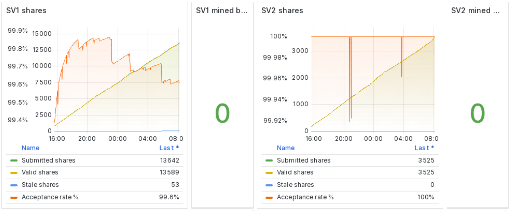

**Results**:

* Shares submitted to **SV1 Pool** from the two miners have been 13642, of which 53 were stale. **Acceptance ratio: 99.6%**
* Shares submitted to **SV2 Pool** from the two miners have been 3525, of which 0 were stale. **Acceptance ratio: 100%**
* No blocks have been mined by both SV1 and SV2 pools

**Analysis**: 

The presence of the SV2 Translator proxy, which aggregates downstream connections into a single one opened with the SV2 Pool has helped in reducing the number of shares sent to the pool. 

In this configuration (A), the proxy is directly connected to a local Job Declarator Client (JDC) which provides the updated jobs to miners. In this way downstreams are updated with fresher jobs in a faster way, and this is the reason behind the 100% acceptance ratio in the shares sent to the SV2 Pool.

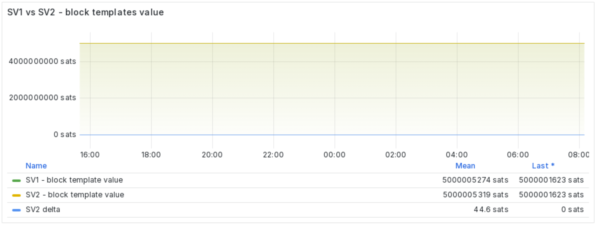

**Results**:

* **SV1** block template average value: **500.005.274 sats**
* **SV2** block template average value: **500.005.319 sats**
* SV2 delta: **44.6 sats**

**Analysis**: 

Since this benchmark has been done on testnet4, the current number of txs in the mempool (and so the amount of fees) are very little. Both SV1 Pool and SV2 Job Declarator Client (JDC) were producing new block templates every 60 seconds, but since the JDC is run locally, it could have been set up to produce updated templates more often (without affecting latency measurements). The advantage of doing that it’s more important on the mainnet, as it will be shown in future more specific benchmarks.

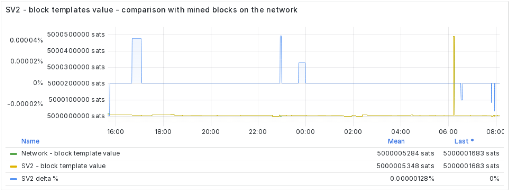

**Results**:

* **Network** block template average value: **500.005.284 sats**
* **SV2** block template average value: **500.005.348 sats**
* SV2 delta: **64 sats (0.00000128%)**

**Analysis**: 

Same as above 

### **_Latency and time measurements_**

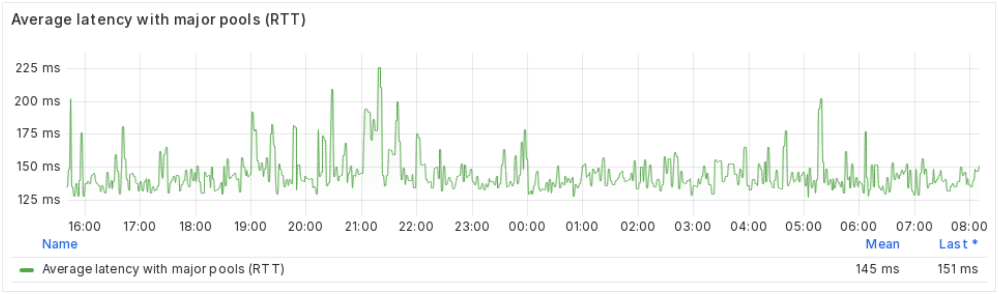

**Results**:

* **Average latency** with major pools (RTT): **145ms**

**Analysis**: 

This is the average latency computed by subscribing to a list of major public pools. Similarly to a ping, it measures the Round Trip Time of packets.

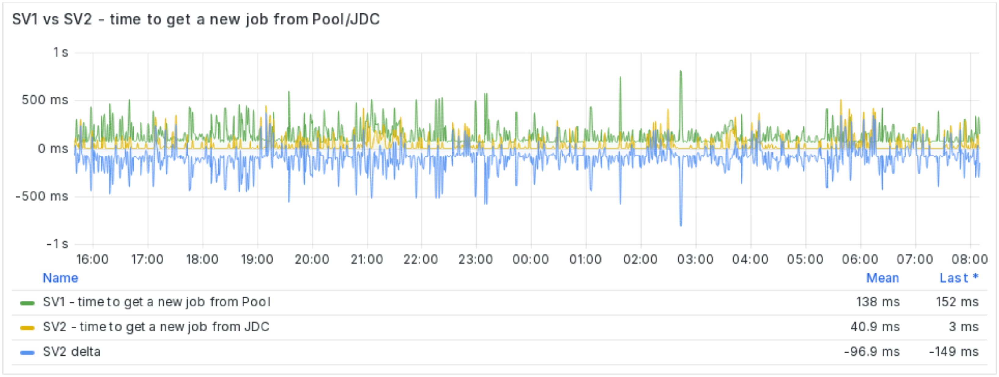

**Results**:

* **SV1** average time to get a new job from Pool: **138ms**
* **SV2** average time to get a new job from Job Declarator Client (JDC): **40.9ms**
* SV2 delta: **-96.9ms (-70.2%)**

**Analysis**: 

The presence of the Job Declarator Client (JDC) in the same network in the mining farm, is drastically reducing the time it takes to send updated jobs to downstream miners. The result shows almost **70% time** which is **saved** because of it, with respect to the SV1 case, in which is the remote SV1 Pool which is sending new jobs to miners.

Considering a **template refresh interval** of **60s** (as in this benchmark), it means that **0,0969s **are saved **every 60s**, which leads to 139,536s every day, which means that **~849 minutes **are **saved** every **year**. 

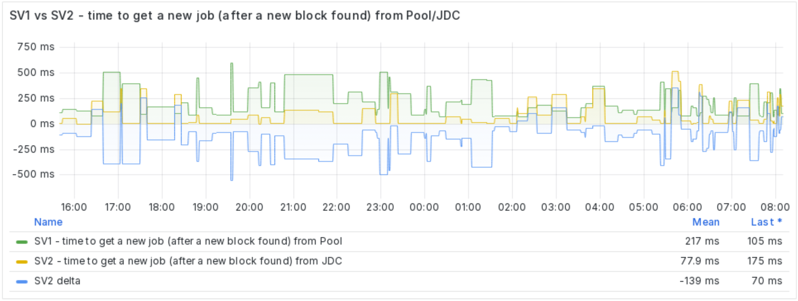

**Results**:

* **SV1** average time to get a new job (based on a new prev-hash) from Pool: **217ms**
* **SV2** average time to get a new job (based on a new prev-hash) from Job Declarator Client (JDC): **77.9ms**
* SV2 delta: **-139ms (-64%)**

**Analysis**: 

The presence of the Job Declarator Client (JDC) in the same network in the mining farm, is drastically reducing the time it takes to send updated jobs (based on a new prev-hash, so after a block is found in the network) to downstream miners. The result shows **64% time** which is **saved** because of it, with respect to the SV1 case, in which is the remote SV1 Pool which is sending new jobs to miners.

Considering a **template refresh interval** of **60s** (as in this benchmark), it means that **0,139s **are saved **every 60s**, which leads to 200,16s every day, which means that **~1218 minutes **are **saved** every **year**. 

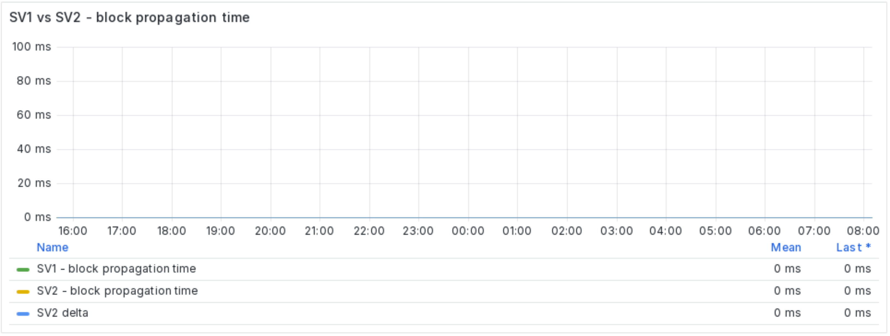

**Analysis**: 

No blocks have been found by both SV1 and SV2 pools, so no particular comment for this benchmark. A more specific analysis on this comparison will be done in a future more specific benchmark done with ASIC miners.

### **_Bandwidth Usage - Mining Farm Level_**

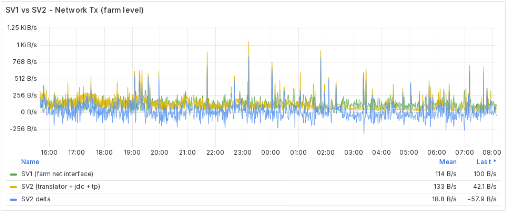

**Results**:

* **SV1** average bandwidth used: **114 B/s**
* **SV2** average bandwidth used: **133 B/s**
* SV2 delta: **+18.8 B/s (+16.5%)**

**Analysis**: 

The presence of a Template Provider (which is a patched bitcoind) in the mining farm increases the bandwidth used for network transmissions. This benchmark has been done on testnet4, so values for mainnet would be even higher because of the more messages exchanged between peers in the network. It will be better analyzed in a future more specific benchmark. For sure, this configuration (A) is better suited for miners who don’t have restrictions on bandwidth at a farm level.

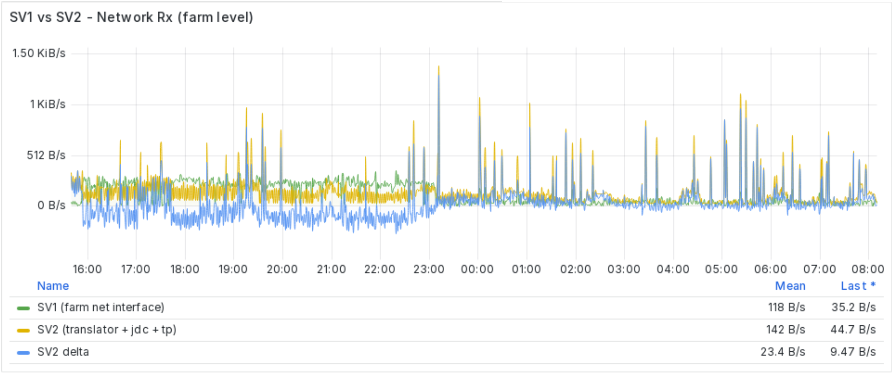

**Results**:

* **SV1** average bandwidth used: **118 B/s**
* **SV2** average bandwidth used: **142 B/s**
* SV2 delta: **+23.4 B/s (+19.8%)**

**Analysis**: 

The presence of a Template Provider (which is a patched bitcoind) in the mining farm increases the bandwidth used for network receptions. This benchmark has been done on testnet4, so values for mainnet would be even higher because of the more messages exchanged between peers in the network. It will be better analyzed in a future more specific benchmark. For sure, this configuration (A) is better suited for miners who don’t have restrictions on bandwidth at a farm level.

* **_Bandwidth Usage - Pool Level_**

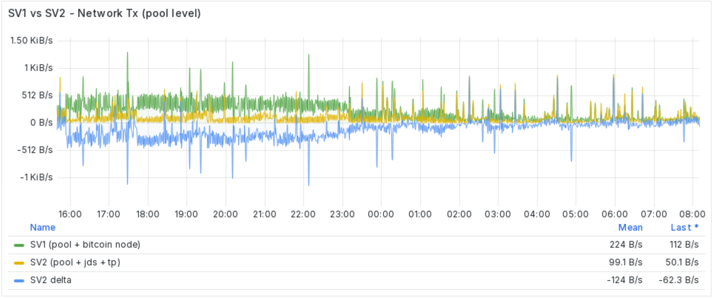

**Results**:

* **SV1** average bandwidth used: **224 B/s**
* **SV2** average bandwidth used: **99.1 B/s**
* SV2 delta: **-124 B/s (-55.35%)**

**Analysis**: 

The presence of a Job Declarator Client (JDC) miner side drastically reduced the amount of bandwidth used by the SV2 Pool to send updated jobs downstream. This benchmark has been done with 2 miners pointed to the SV1 setup and 2 miners pointed to the SV2 setup, so the benefit would probably be even higher for a larger number of machines. This will be one point of focus in a future benchmark.

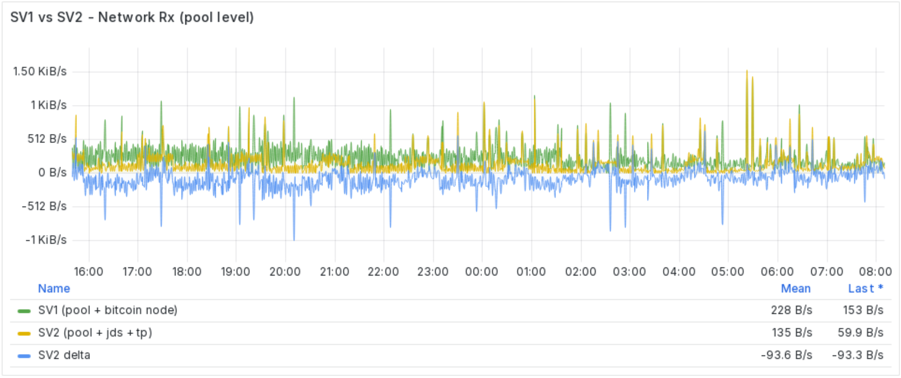

**Results**:

* **SV1** average bandwidth used: **228 B/s**
* **SV2** average bandwidth used: **135 B/s**
* SV2 delta: **-93.6 B/s (-41%)**

**Analysis**: 

The presence of proxies which aggregates downstream connections miner side drastically reduced the amount of bandwidth used by the SV2 Pool to receive shares from the mining farm. This benchmark has been done with 2 miners pointed to the SV1 setup and 2 miners pointed to the SV2 setup, so the benefit would probably be even higher for a larger number of machines. This will be one point of focus in a future benchmark.

## **Configuration C Analysis:**

### **_Shares, blocks and templates stats_**

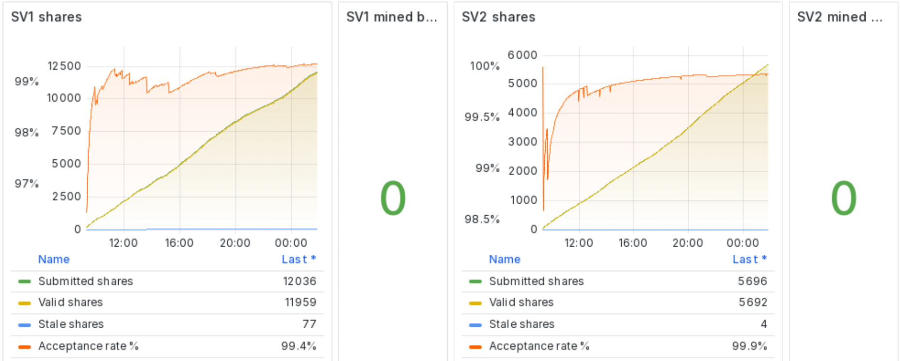

**Results**:

* Shares submitted to **SV1 Pool** from the two miners have been 12036, of which 77 were stale. **Acceptance ratio: 99.4%**
* Shares submitted to **SV2 Pool** from the two miners have been 5896, of which 4 were stale. **Acceptance ratio: 99.9%**
* No blocks have been mined by both SV1 and SV2 pools

**Analysis**: 

The presence of the SV2 Translator proxy, which aggregates downstream connections into a single one opened with the SV2 Pool has helped in reducing the number of shares sent to the pool. 

In this configuration (C), SV2 mining jobs are created and sent by the SV2 Pool, as it is for the SV1 context. Even if there’s a proxy in the SV2 setup, this configuration still pays the price related to latency between the pool and the miner, and that’s the reason behind the 4 stale shares (which were 0 in the configuration A).

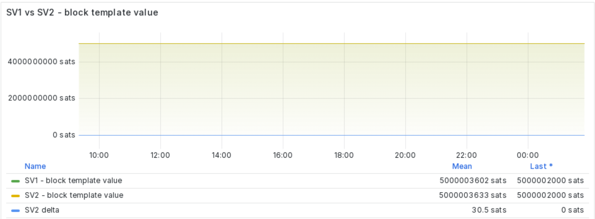

**Results**:

* **SV1** block template average value: **500.003.602 sats**
* **SV2** block template average value: **500.003.633 sats**
* SV2 delta: **30.5 sats**

**Analysis**: 

Since this benchmark has been done on testnet4, the current number of txs in the mempool (and so the amount of fees) are very little. Both SV1 and SV2 Pool were producing new block templates every 60 seconds.

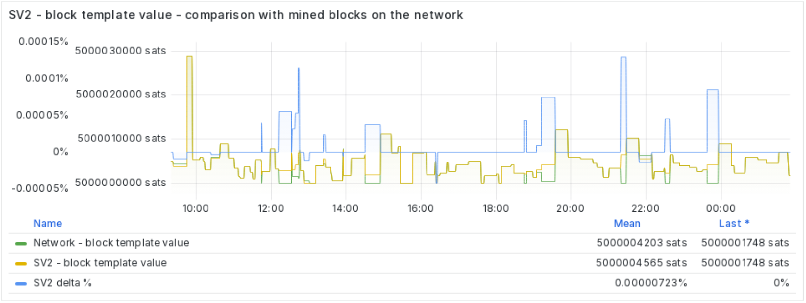

**Results**:

* **Network** block template average value: **500.004.203 sats**
* **SV2** block template average value: **500.004.565 sats**
* SV2 delta: **362 sats (0.00000723%)**

**Analysis**: 

Same as above 

### **_Latency and time measurements_**

**Results**:

* **Average latency** with major pools (RTT): **129ms**

**Analysis**: 

This is the average latency computed by subscribing to a list of major public pools. Similarly to a ping, it measures the Round Trip Time of packets.

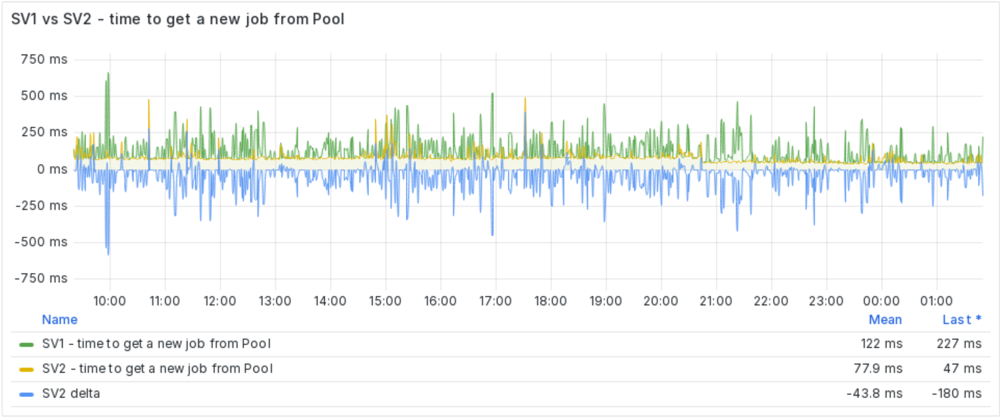

**Results**:

* **SV1** average time to get a new job from Pool: **122ms**
* **SV2** average time to get a new job from Job Declarator Client (JDC): **77.9ms**
* SV2 delta: **-43.8ms (-35.9%)**

**Analysis**: 

Even if SV2 miners receive jobs from the SV2 Pool (as for SV1 scenario), the time it takes to send updated jobs to downstream miners is reduced. This is probably due to the efficiency of SV2 message framing, which results in a faster communication between pool and miners, leading to a **36% time** which is **saved** because of it.

Considering a **template refresh interval** of **60s** (as in this benchmark), it means that **0,0779s **are saved **every 60s**, which leads to 112,176s every day, which means that **~682 minutes **are **saved** every **year**. 

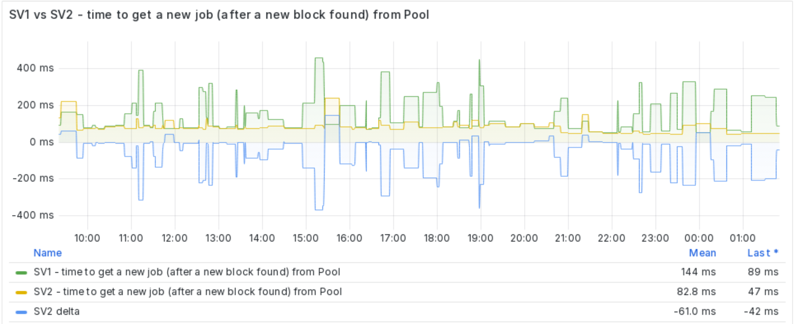

**Results**:

* **SV1** average time to get a new job (based on a new prev-hash) from Pool: **144ms**
* **SV2** average time to get a new job (based on a new prev-hash) from Job Declarator Client (JDC): **82.8ms**
* SV2 delta: **-61ms (-42.4%)**

**Analysis**: 

Even if SV2 miners receive jobs from the SV2 Pool (as for SV1 scenario), the time it takes to send updated jobs (based on a new prev-hash, so after a block is found in the network) to downstream miners is reduced. This is probably due to the efficiency of SV2 message framing, which results in a faster communication between pool and miners, leading to a **42% time** which is **saved** because of it.

Considering a **template refresh interval** of **60s** (as in this benchmark), it means that **0,0828s **are saved **every 60s**, which leads to 119,232s every day, which means that **~725 minutes **are **saved** every **year**. 

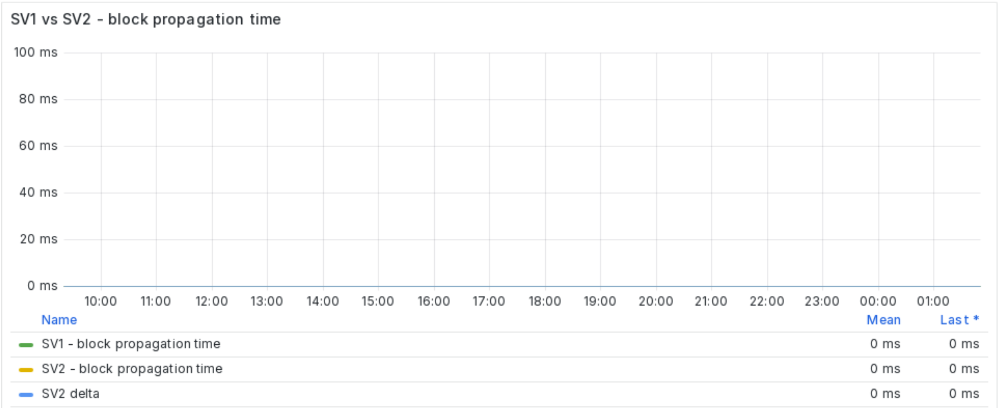

**Analysis**: 

No blocks have been found by both SV1 and SV2 pools, so no particular comment for this benchmark. A more specific analysis on this comparison will be done in a future more specific benchmark done with asic miners.

### **_Bandwidth Usage - Mining Farm Level_**

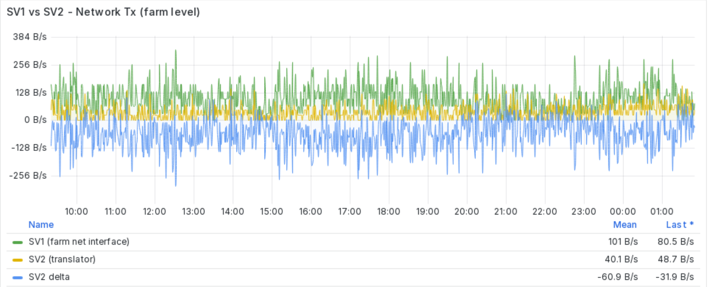

**Results**:

* **SV1** average bandwidth used: **101 B/s**
* **SV2** average bandwidth used: **40.1 B/s**
* SV2 delta: **-60.9 B/s (-60.3%)**

**Analysis**: 

Since in this configuration (C) there is just the SV2 Translator proxy running on site, the bandwidth used for network transmissions is just the one used to send shares upstream. Given that the proxy aggregates downstream miners connections, the result is a **60% **enhancement in bandwidth usage.** ** Differently from configuration (A), this setup is better suited for miners who could have some restrictions on bandwidth at a farm level, and cannot afford running a Bitcoin node in their mining farm.

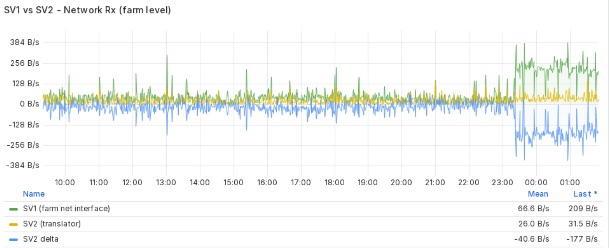

**Results**:

* **SV1** average bandwidth used: **66.6 B/s**
* **SV2** average bandwidth used: **26.0 B/s**
* SV2 delta: **-40.6 B/s (-61%)**

**Analysis**: 

Since in this configuration (C) there is just the SV2 Translator proxy running on site, the bandwidth used for network receptions is just the one used to receive new jobs from the SV2 Pool. Given that the proxy aggregates downstream miners connections, the result is a **61% **enhancement in bandwidth usage.** ** Differently from configuration (A), this setup is better suited for miners who could have some restrictions on bandwidth at a farm level, and cannot afford running a Bitcoin node in their mining farm.

### **_Bandwidth Usage - Pool Level_**

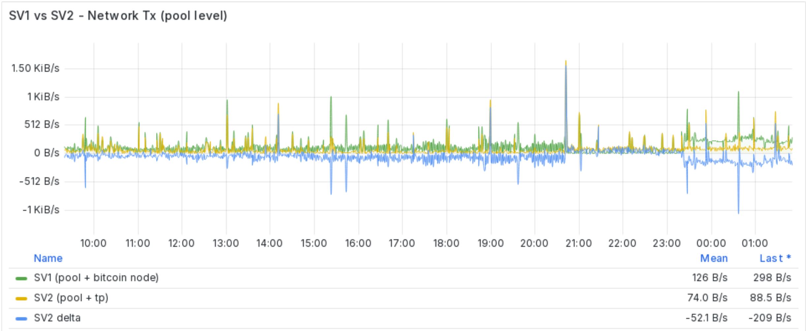

**Results**:

* **SV1** average bandwidth used: **126 B/s**
* **SV2** average bandwidth used: **74.0 B/s**
* SV2 delta: **-52.1 B/s (-41.35%)**

**Analysis**: 

The presence of the SV2 Translator proxy in the mining farm reduced the amount of bandwidth used by the SV2 Pool to manage downstreams. This benchmark has been done with 2 miners pointed to the SV1 setup and 2 miners pointed to the SV2 setup, so the benefit would probably be even higher for a larger number of machines. This will be one point of focus in a future benchmark.

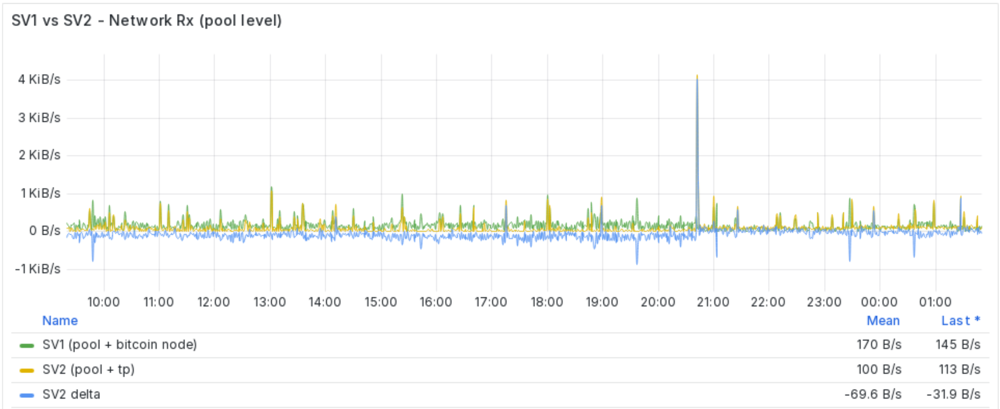

**Results**:

* **SV1** average bandwidth used: **170 B/s**
* **SV2** average bandwidth used: **100 B/s**
* SV2 delta: **-69.6 B/s (-41%)**

**Analysis**: 

The presence of the SV2 Translator proxy in the mining farm reduced the amount of bandwidth used by the SV2 Pool to receive shares from the mining farm. This benchmark has been done with 2 miners pointed to the SV1 setup and 2 miners pointed to the SV2 setup, so the benefit would probably be even higher for a larger number of machines. This will be one point of focus in a future benchmark.

## Conclusions and Future Prospects 🔜

#### **Summary of Key Points:**

The benchmarking results provide a detailed comparison between Configuration A and Configuration C, each tested under the same conditions. Key findings include:

1. **Share Submission and Acceptance**: Configuration A showed a higher acceptance ratio (100%) for shares submitted to the SV2 pool compared to Configuration C (99.9%), indicating the effectiveness of the SV2 Translator proxy and the local Job Declarator Client (JDC) in reducing latency and improving efficiency.
2. **Block Template Values**: Both configurations demonstrated minor differences in block template values on testnet4, with SV2 consistently showing slightly higher average values, reflecting its potential for better fee capture in a real-world scenario.
3. **Latency and Time Measurements**: Configuration A significantly reduced latency for job updates and new jobs based on a new prev-hash due to the local JDC, saving substantial time over a year. Configuration C also showed improvements, albeit less pronounced, due to the efficiency of SV2 message framing.
4. **Bandwidth Usage**: Configuration A, with a local Template Provider, increased bandwidth usage at the mining farm level but reduced it at the pool level. Configuration C, with only the SV2 Translator proxy, significantly reduced bandwidth usage both at the mining farm and pool levels, making it more suitable for environments with bandwidth constraints.

#### **Future Improvements:**

To enhance the benchmarking tool and provide more comprehensive insights, the following improvements and additional metrics could be considered:

1. **Incorporate ASIC Miners**: Future benchmarks should include ASIC miners to evaluate performance and efficiency under real-world conditions, as the current test was limited to CPU miners.
2. **Mainnet Testing**: Conducting benchmarks on the mainnet will provide more accurate data, particularly regarding transaction fees and block template values.
3. **Extended Time Frames**: Running benchmarks over longer periods will help capture variations and provide more robust data on performance and efficiency.
4. **Scalability Tests**: Assessing how each configuration scales with an increasing number of miners will help determine their suitability for larger mining operations.

By addressing these areas, future benchmarks will offer deeper insights, enabling more informed decisions for optimizing mining setups and improving overall efficiency.

## Appendices

* **PDF** with **complete benchmarks** analyzed in this document : 
  * [Configuration A](https://github.com/stratum-mining/benchmarking-tool/reports/first-report-ever-config-a.pdf) 
  * [Configuration C](https://github.com/stratum-mining/benchmarking-tool/reports/first-report-ever-config-c.pdf) 
* Benchmarking tool main **repository**: [https://github.com/stratum-mining/benchmarking-tool](https://github.com/stratum-mining/benchmarking-tool) 
* Benchmarking tool **discussion**: [https://discord.com/channels/950687892169195530/1107964065936060467](https://discord.com/channels/950687892169195530/1107964065936060467) 
* Benchmarking tool initial **documentation** and **requirements** definition: https://github.com/stratum-mining/benchmarking-tool/docs/requirements-document.md
* Benchmarking tool **system design**: https://github.com/stratum-mining/benchmarking-tool/docs/system-design.png 