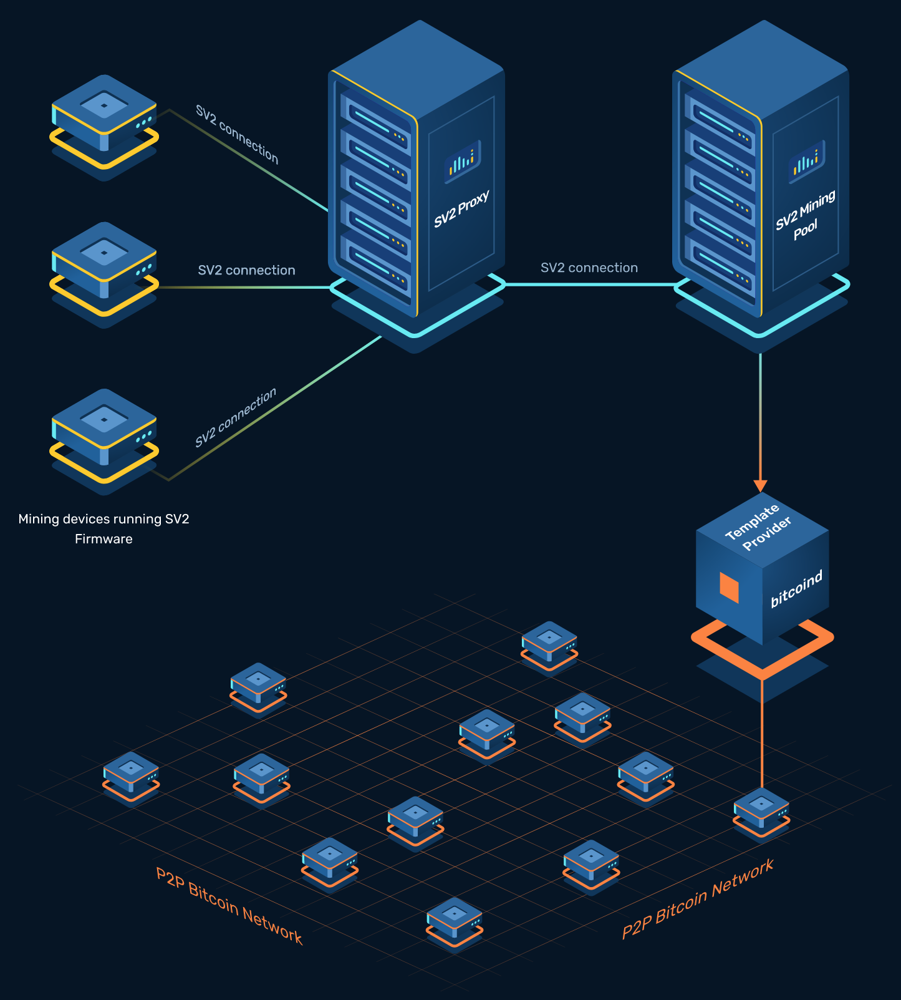
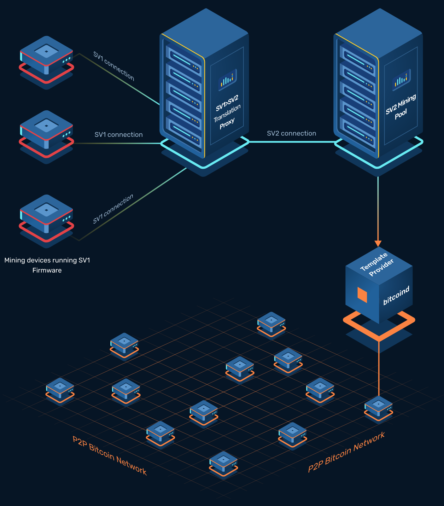
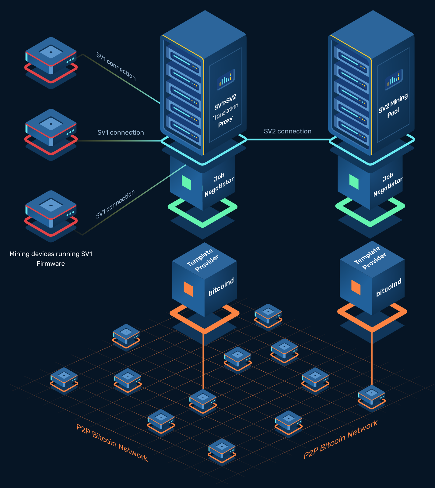
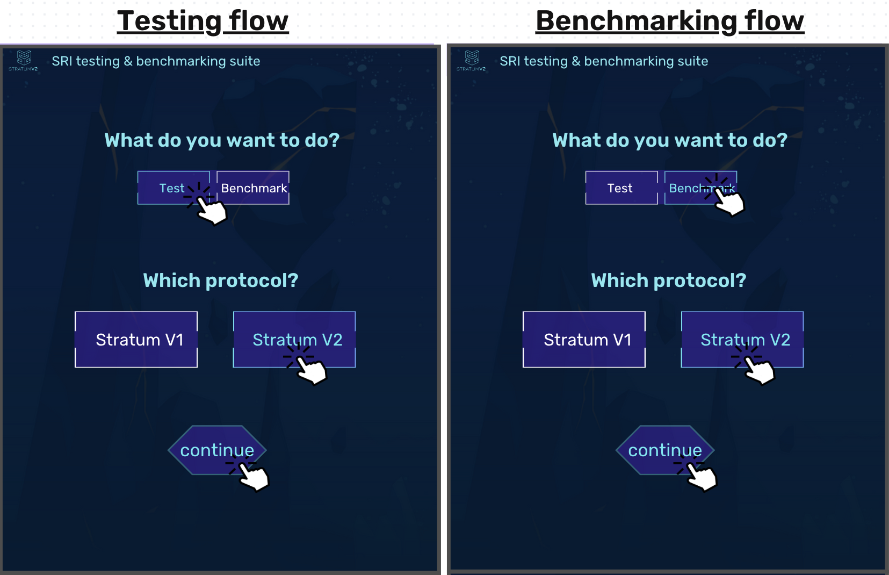
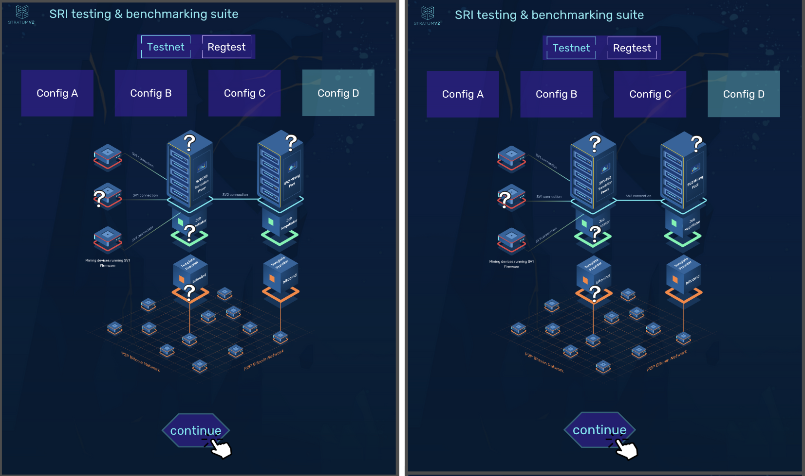
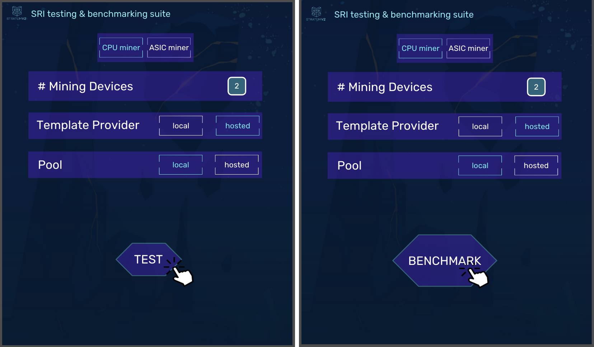
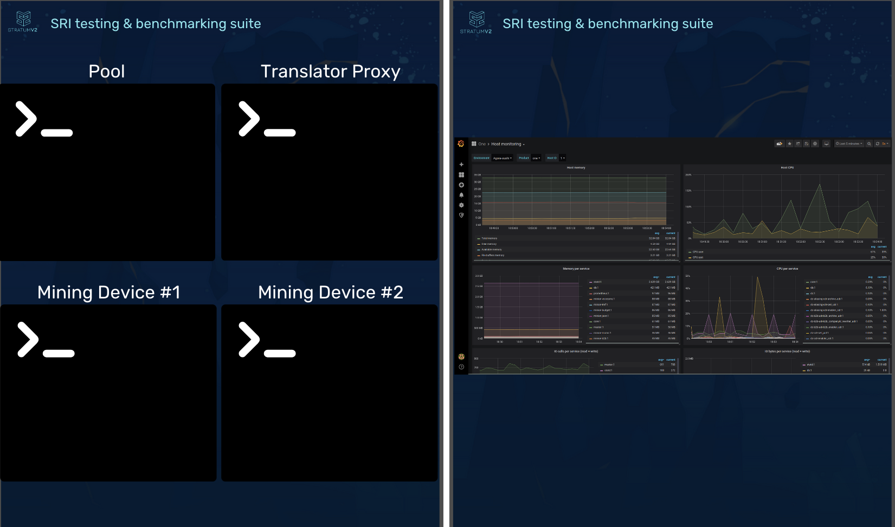

# Stratum V2 (SRI) - Benchmarking Tool Documentation

## **Introduction**

_Stratum_ _V2_ is the necessary upgrade of the present standard pooled mining protocol (_stratum_). Due to the design of the current protocol, nowadays transaction selection is done by mining pools. For this reason, pools can be an attack vector for Bitcoin since they can easily receive pressure from regulators and States, who could want to undermine the censorship resistance of the network. _Stratum v2_ completely flips this paradigm, moving the power of creating block templates to the miners, improving the decentralization of the mining stack. Moreover, it improves both security and performance by using an encrypted and binary protocol.

To encourage its adoption, a complete evaluation and measurements of the enhancements brought by _SV2_ is needed. A tool which is able to easily test and benchmark protocol performances in different mining scenarios, capable of comparing the current _stratum_ with _SV2_ is necessary. In this way, mining industry professionals and the broader market will be able to easily understand every possible configuration permitted by _[SRI](stratumprotocol.org) **(Stratum v2 Reference Implementation)**_, evaluating and measuring themselves the potential benefits in terms of efficiency and profitability. The development of a testing & benchmarking tool plays a crucial role in facilitating a smoother transition to _Stratum v2_, increasing decentralization, security, and empowering the Bitcoin network as a whole.

### **Goals**

1. Enable miners and pool operators to easily **test** and **benchmark** **_SRI_ configurations**:
   
    - **Configuration A**     
    As already said, in the current SV1 protocol, transaction sets to be mined in the next blocks are selected by pools. With this SV2 configuration they’re selected by individual miners. In this case, miners run **SV2 firmware**, connecting to the **SV2 Mining Proxy**. Using the **Job Declarator** role, individual miners are able to pick up their transactions locally, extracting them from their local **Template Provider**, and declare them to an **SV2 Pool**.

   - **Configuration B**     
    Mining Devices run **SV2 firmware**, so they are able to connect to a **SV2 Mining Proxy** (typically through a standard channel). The proxy aggregates all the standard channels opened into just one open channel with the **SV2 Pool** (group channel or an extended channel). In this configuration, the Proxy **doesn’t** **have** the **Job Declarator** setup, so it’s unable to select transactions from its local Template Provider. Transactions selection is done by the SV2 Pool, as it is in SV1, but now it can benefit from all the **security and performance** features brought by SV2.

    - **Configuration C**     
    Mining Devices **don’t need** to run a **SV2 firmware**. The Proxy which is used to let for efficiency, is also able to translate the SV1 messages that come from the Mining Devices into SV2 messages for the SV2 Pool. In this case, the **Translator Proxy** is not configured to talk to a local Template Provider, so transaction selection is done by the pool. However, this configuration permits to test and use the SV2 protocol features **without** installing any other **SV2 firmware** on the machines.

    - **Configuration D**     
   This configuration is very similar to the previous (config C), but it’s able to add the **transactions selection** feature to it. As represented in this figure, the **Translator Proxy** is joined by a **Job Declarator Client** and a **Template Provider**: it’s able, in this way, to build its own block templates and declare them to the **SV2 Pool**, through an extended channel.

Configuration A            |  Configuration B         |    Configuration C         |    Configuration D
:-------------------------:|:-------------------------:|:-------------------------:|:-------------------------:
  |    |    |  

2. Facilitate **testing**, **bug reporting** and **feedback collection** from testers:
    - Provide a testing suite to easily test every _SRI_ configuration
    - Easy way to customize every _role_ configuration
    - Incorporate bug reporting mechanisms into testing tool
      
3. Provide a pre-built **benchmarking** tool for mining industry stakeholders to **evaluate SV2** protocol performances:
    - Generate benchmark data for every _SRI_ configuration.
    - Automatic report generation containing benchmark data
      
4. Provide a way to **compare **protocol **performances** between** SV2 and SV1**:
    - Generate benchmark data for SV1 context
    - Automatic comparison report generation
      
5. Allow external verification of benchmark data documented in the future **SV1-SV2 comparison** report.

## **Interface**

## **Requirements**

### Functional Requirements

1. Enable miners and pool operators to easily **test** and **benchmark** **_SRI_ configurations**
    1. **Configuration management**:
        * The tool should allow users to easily configure and switch between different SRI configurations (A, B, C, D) to run various mining scenarios.
        * Provide a user-friendly interface for adjusting parameters such as individual miner settings, pool and proxy configurations, and template provider options.
        * Design a user-friendly interface that empowers users with the flexibility to choose between running every role locally or utilizing roles hosted by the Stratum v2 (SRI) team:
            * local/hosted Template Provider role selection
            * local/hosted Pool role selection
            * local/hosted Job Declarator Server role selection
    2. **Scenario simulation**:
        * Enable simulation of real-world mining scenarios, including multiple SV2 mining devices, multiple SV1 mining devices, and proxies
    3. **Performance metrics**:
        * Collect and display relevant performance metrics for each SRI configuration
        * Allow users to easily interpret and analyze the benchmark results.
2. Facilitate **testing, bug reporting** and **feedback collection** from testers
    1. **Testing suite:**
        * Provide a comprehensive testing suite that covers all the possible SRI configurations.
        * The tool must handle both **real ASIC** machines and **CPU/SRI** miners
        * Provide the possibility to test scenarios on both **testnet** and **mainnet** environments.
    2. **Customization options:**
        * Offer an intuitive interface for users to customize each role's configuration parameters, enabling them to tailor the testing environment to their specific needs.
        * Include detailed documentation on how to modify configurations to accommodate different network setups.
    3. **Bug Reporting Mechanisms:**
        * Integrate a built-in mechanism for testers to easily report bugs and provide feedback within the tool.
        * Include options for attaching logs, screenshots, or additional diagnostic information to assist developers in troubleshooting reported issues.
3. Provide a pre-built **_benchmarking_** tool for mining industry stakeholders to evaluate SV2 **protocol performances**
    1. **Benchmark Data Generation:**
        * Develop a tool capable of generating consistent and reliable benchmark data for every SRI configuration:
            * **Latency** between SRI roles:
                * Pool &lt;-> Proxy (Mining Proxy or Translator)
                * Proxy (Mining Proxy or Translator) &lt;-> Mining Device
                * Pool &lt;-> Mining Device
                * Job Declarator Server &lt;-> Job Declarator Client
                * Template Provider &lt;-> Job Declarator Server/Client
            * **Number of messages (and size)** exchanged in every role communication
            * **Bandwidth** used in every role-to-role communication
            * **Pool load:**
                * Utilization of resources on the pool’s server side, considering factors like CPU and memory usage.
            * **Translator/Mining Proxy load:**
                * Resource utilization on the translator or mining proxy side.
            * **Encryption overhead and connection establishment time:**
                * Additional processing time and resource usage introduced by encryption mechanisms.
                * Handshake time in connections setup between roles
            * **Shares submitted:**
                * Number of shares submitted by miners within a specific time frame
            * **Stale shares:**
                * Number of stale shares within a specific time frame
            * **Time measurement of specific pooled mining scenarios:**
                * Time to get a new job from the Pool
                * Time to get a new job from the local Job Declarator Client
                * Time to get a new template (after a new block found) from the Pool
                * Time to get a new template (after a new block found) from the local Job Declarator Client
                * Time to send a valid block to the Pool (in order to be propagated)
                * Time to send a valid block to the local Job Declarator Client
            * **Mining Revenues Impact:**
                * _Analysis:_ Assess the impact of latency improvement on mining revenues by considering factors such as:
                    * Faster solution propagation leading to more successful mining.
                    * Reduced stale shares due to quicker communication.
                    * Enhanced efficiency in block template creation.
            * **Overall System Efficiency:**
                * _Analysis:_ Evaluate the overall efficiency of the mining system by considering latency improvements, resource utilization, and success rates.
        * Include options for long-term benchmarking to observe performance trends over time.
    2. **Automatic Report Generation:**
        * Implement an automatic report generation feature that summarizes benchmark results for each SRI configuration.
        * Reports should be easily interpretable and include visualizations for quick insights.
4. Provide a way to **compare** protocol performances between **SV2 and SV1**
    1. **SV1 Context Benchmarking:**
        * Include functionality to benchmark the performance of the current SV1 protocol for comparison with Stratum v2 configurations.
        * Generate relevant metrics as the ones mentioned above, to be able to evaluate them between SV1 and SV2.
    2. **Automatic Comparison Report:**
        * Develop an automatic comparison report generation feature that highlights the differences in performance between SV1 and SV2.
        * Include visual representations to aid in the understanding of the advantages introduced by SV2 over SV1.
5. Allow external verification of benchmark data documented in the future **SV1-SV2 comparison** report
    1. **Data Export and Documentation:**
        * Provide mechanisms to export benchmark data in a standardized format that allows external verification.
        * Include comprehensive documentation on the benchmarking methodology, ensuring transparency and reproducibility of results.

### Non-Functional Requirements

* Efficient execution of benchmark tests.
* Scalability for handling different SRI configurations.
* Easy configuration and usage.

## **References**

### Technical Documentation

* [https://stratumprotocol.org/docs/](https://stratumprotocol.org/docs/) 
* [https://stratumprotocol.org/specification/](https://stratumprotocol.org/specification/)
* [https://github.com/GitGab19/Stratum-V2-Master-Degree-Thesis](https://github.com/GitGab19/Stratum-V2-Master-Degree-Thesis) 
* [https://github.com/stratum-mining](https://github.com/stratum-mining) 

### Contacts

* [gabriele.vernetti@protonmail.com](mailto:gabriele.vernetti@protonmail.com)
* @gitgab19 (twitter and telegram handle)

## **Survey**

Please complete the survey to let me know your feedback and provide me some suggestions about the documentation and the tool itself: [https://47r5o81bk9b.typeform.com/to/bBgHVBl3](https://47r5o81bk9b.typeform.com/to/bBgHVBl3) 
